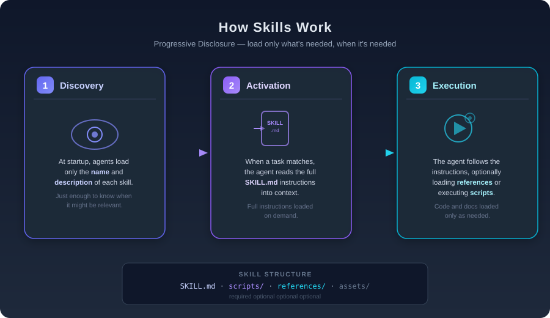

# Agent Skills — Microsoft.Agents.AI

Example of using **`FileAgentSkillsProvider`** from the [`Microsoft.Agents.AI`](https://www.nuget.org/packages/Microsoft.Agents.AI) package to give an AI agent "skills" via Markdown files.

The agent acts as a **Contoso** corporate assistant and has two skills:

| Skill | Description |
|---|---|
| `expense-report` | Files and validates expense reports according to company policy |
| `employee-onboarding` | Guides new employees through the onboarding process |

## How Skills Work

Skills use **progressive disclosure** to manage context efficiently:

1. **Discovery** — At startup, the agent loads only the `name` and `description` of each available skill (just enough to know when it might be relevant).
2. **Activation** — When a task matches a skill's description, the agent reads the full `SKILL.md` instructions into context.
3. **Execution** — The agent follows the instructions, optionally loading referenced files or assets as needed.



## Skill Structure

```
my-skill/
├── SKILL.md          # Required: instructions + metadata
├── assets/           # Optional: templates, checklists, forms
├── references/       # Optional: documentation, FAQs
└── scripts/          # Optional: executable code
```

## Prerequisites

- [.NET 10 SDK](https://dotnet.microsoft.com/download/dotnet/10.0)
- Access to an **Azure OpenAI** resource with a chat deployment (default: `gpt-4.1-mini`)
- Authentication via `DefaultAzureCredential` (Azure CLI, Visual Studio, etc.)

## Setup

Create a `.env` file in `src/AgentSkills/`:

```env
AZURE_OPENAI_ENDPOINT=https://<your-resource>.openai.azure.com/
AZURE_OPENAI_DEPLOYMENT_NAME=gpt-4.1-mini
```

## Running

```bash
cd src/AgentSkills
dotnet run
```

The program runs two examples:

1. **Expense policy question** — activates the `expense-report` skill and queries the reference FAQ to answer about tip reimbursement.
2. **Expense report filling** — uses the skill's template to draft a report with the provided data, highlighting what's missing.

## Packages

| Package | Version |
|---|---|
| `Microsoft.Agents.AI` | 1.0.0-rc4 |
| `Microsoft.Agents.AI.OpenAI` | 1.0.0-rc4 |
| `Azure.AI.OpenAI` | 2.9.0-beta.1 |
| `Azure.Identity` | 1.19.0 |
| `dotenv.net` | 4.0.1 |

## License

See the [LICENSE](LICENSE) file.
